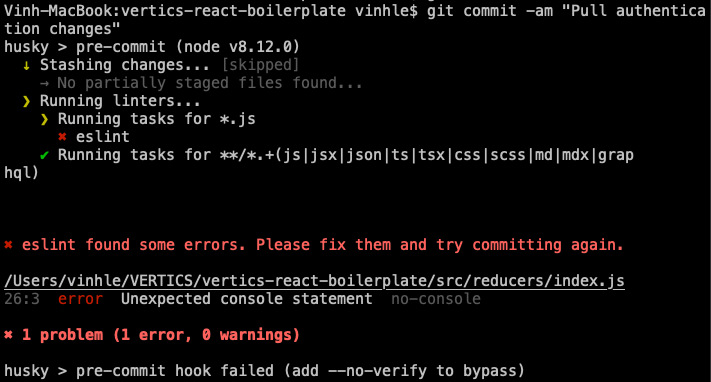

# How to hack the most out of this boilerplate

## Static checking

[Husky](https://github.com/typicode/husky) and [Lint-staged](https://github.com/okonet/lint-staged) are setup for linting in every commit hook. In pre-commit stage, `eslint` will check if there are any errors following its existing rules in [`eslintrc`](../.eslintrc) and stop the commit:



**Prettier** is also already configured. Rules are stated in [`.prettierrc`](../.prettierrc). To format the code by those rules, run:

```bash
yarn run format
```

Some scripts are also specified in [`package.json`](../package.json) for linting and formatting code, for instance:

```bash
yarn run validate
```

## Routing

If there is authentication built in the app, there is already a reusable [`ProtectedRoute`](../src/components/Authentication/ProtectedRoute.jsx) to house routes that are only accessible for authenticated users. This component is customized to be used in a very similar way to normal `react-router-dom Route`:

```javascript
<ProtectedRoute exact path="/" component={() => <Home star={100000} />} />
```

What `ProtectedRoute` does under the hood is to get authentication status of the user from [`AuthChecker`](../src/components/Authentication/AuthChecker.jsx). And decide if it should load the component or redirect unauthenticated user to `Login` route.

## Redux action creators and reducers

Path to `actions` and `reducers` directories are configured as `alias` in [`webpack-config`](../webpack). Therefore, importing them inside components is as easy as:

```javascript
import action_name from 'actions'
import selector_name from 'reducers'
```

### Selectors

The main functionality of selector is to quicly get a piece of state from a reducer. For example, in order to quickly grab `user` out of `loginReducer`:

**loginReducer**

```javascript
export const getUser = (state = initialState) => {
	return state.user
}
```

**rootReducer**

```javascript
import { getUser } from 'loginReducer'
...
export { getUser }
```

**React component**

```javascript
import { getUser } from 'reducers'
...

const mapStateToProps = state => ({
 user: getUser(state.loginReducer)
})
```

Custom selectors could be added within reducer components and export in [`rootReducer`](../src/components/reducers/index.js)

## Constants

[`constants.js`](../src/components/constants.js) houses all frequent-use constants inside components. The path to this file is configured already in webpack as well.

To illustrate: there are already 2 contants: `IMAGE_PATH` and `ICON_PATH` for quickly importing images/icons:

**React component**

```javascript
import { IMAGE_PATH, ICON_PATH } from 'constants';

...


```
